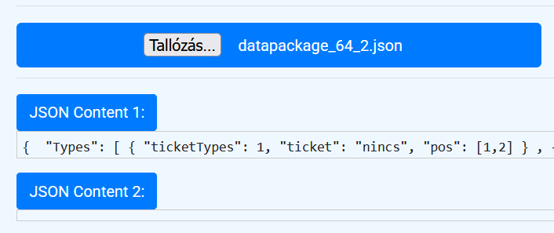
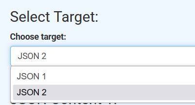
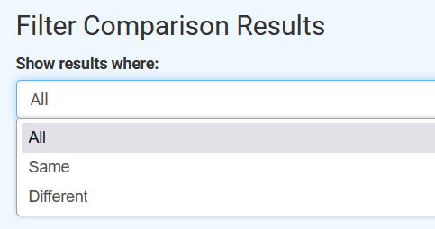
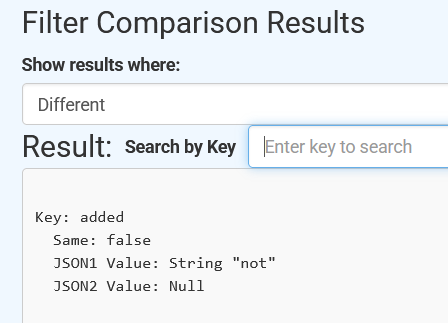
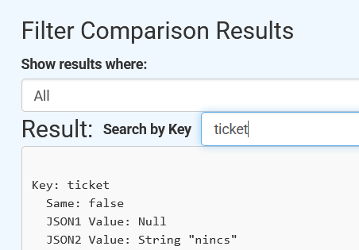

# JsonToolboxWebApp

## Project Overview

JsonToolboxWebApp is a web application designed to process, validate, and compare JSON files.
Built with F# and WebSharper, the application provides a user-friendly interface for JSON analysis.

---

## Motivation
The JsonToolboxWebApp was created to facilitate the comparison of JSON files and identify differences between them.
The application serves as a foundation for further development, with potential features such as JSON editing,
merging, and exporting comparison results for broader use cases.

## Features

### 1. Customizable Output
- Allows filtering of comparison results based on the `same` property:
   - Show all results.
   - Show only identical entries (`same = true`).
   - Show only differing entries (`same = false`).
- Dynamically updates the output when the filter changes.

### 2. **Key Filter Search Feature**
- Allows users to filter the comparison results by entering a specific key.
- Displays only the comparison results related to the provided key.
- Real-time updates to displayed results when the filter changes (`OnChange` event listener).

#### Notes
- The search is case-sensitive.
- If the key does not exist in either of the JSON files, no results will be displayed.

---
## Screenshots

### 1. Select File

### 2. Select Target

### 3. Select Filter

### 4. Result Section

### 5.  Key Search

---

## How It Works

### 1. Validation
The `traverseJsonDocument` function reads and parses JSON files using JavaScript's `JSON.parse`.
Invalid files result in descriptive error messages.

### 2. Traversing
The `traverseElement` function recursively processes JSON structures:
- Supports strings, numbers, booleans, arrays, objects, and `null`.
- Ensures robust handling of edge cases like `null`.

### 3. Comparison
The `compareJsonValues` function compares two JSON structures recursively:
- Identifies differences in keys, values, and array sizes.
- Outputs results as a `UnionDictionary`.

### 4. Filtering
The filtering logic dynamically adjusts the displayed results based on user selection:
- Filters by `same = true`, `same = false`, or shows all entries.
- Updates output in real-time when the filter changes.
- The Key Filter Search feature allows users to filter the comparison results by entering a specific key.
- If a key is provided, the application will display only the comparison results related to that key.
- This functionality ensures a more focused analysis of JSON differences.

---

## File Structure

### Key Files
1. **JsonTraverser.fs**:
   - Contains functions for parsing and traversing JSON files using JavaScript's native `JSON.parse`.
   - Handles recursive navigation of objects and arrays.

2. **JsonComparator.fs**:
   - Implements recursive comparison logic for JSON files.
   - Defines types like `ComparisonResult` and `UnionDictionary`.

3. **Client.fs**:
   - Manages client-side functionality, including file input handling and dynamic UI updates.
   - Integrates filtering logic for comparison results.

4. **Main.fs**:
   - Server-side entry point for the application.
   - Handles routing, templates, and rendering.

5. **Main.html**:
   - Defines the web interface with sections for file input, target selection, and comparison result display.

6. **Client.css**:
    - Defines the CSS styles for the web interface.
   
7. **wsconfig.json**:
   - Configuration file specifying project settings (e.g., output directory).

## Dependencies

1. **WebSharper**:
   - Provides tools for building reactive web applications in F#.

2. **JavaScript Native JSON Handling**:
   - Uses JavaScript's native `JSON.parse` for parsing and processing JSON data directly in the browser environment.

3. **FSharp.Formatting** (optional):
   - Enables Markdown parsing for rendering documentation dynamically (if used).

## Usage

### Installation
1. Clone the repository: https://github.com/BRTHrepo/JsonToolboxWebApp

Access the live version of JsonToolboxWebApp here:  
[JsonToolboxWebApp Live](https://brthrepo.github.io/JsonToolboxWebApp/index.html)

---